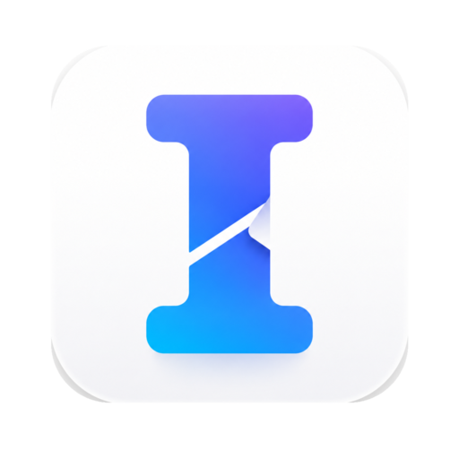
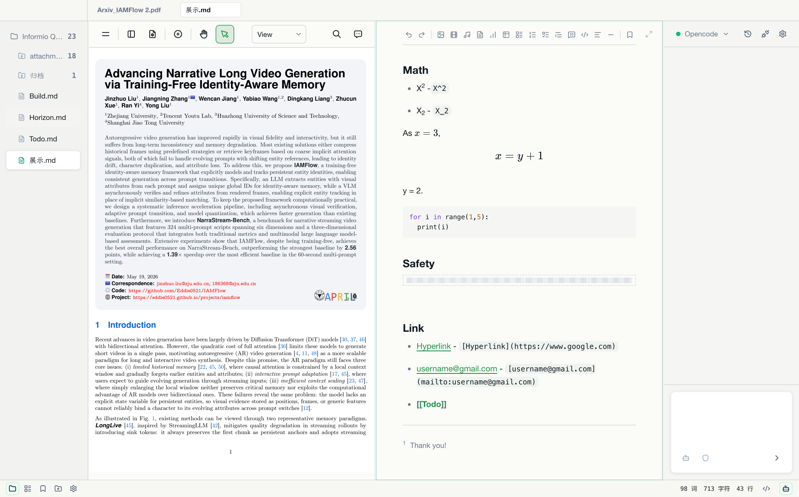

<p align="right">
  <a href="./README.md">English</a> | 简体中文
</p>

<p align="center">
  
</p>

<h1 align="center">Informio</h1>

<p align="center">
  <a href="https://github.com/Eddie0521/Informio/releases/latest"></a>
  
  
  <a href="./LICENSE"></a>
</p>

<p align="center">
  <em>“我写作，完全是为了弄清自己在想什么。” - Joan Didion</em>
</p>

<p align="center">
  
</p>

## Features

- **项目制**：不需要把所有资料都整理到同一个文件夹。用到哪个项目、哪个目录，直接添加进来就能开始。
- **专注**：Markdown、PDF、图片、视频、音频都可以在一个工作区里审阅。标记重点、记录想法、安排 Agent 执行任务，不用在一堆工具之间来回切换。
- **安全**：Local-first，无数据收集。通过口令锁定敏感笔记，让 Agent 能使用工作所需上下文，同时避免浏览你的私人内容。
- **简单**：无数据库，无复杂引导。打开 Informio，导入项目，直接开始工作。Informio 完全依赖本地安装的 Agent，最大程度复用用户原本的设置。
- **适合研究整理**：PDF 预览高亮、Markdown 编辑记录、Agent 直接看到完整上下文，让阅读、记录和后续执行连在一起。

## Quick Start

1. 从 [GitHub Releases](https://github.com/Eddie0521/Informio/releases/latest) 下载最新版本。
2. 打开 Informio，添加你正在使用的项目文件夹。Markdown 文件会留在原来的位置，不需要搬进固定目录。
3. 直接在中间编辑区开始写作。只有需要文件、媒体或 Agent 上下文时，再展开两侧面板。
4. 如果要使用 Agent，请先确认本地已经安装并登录对应的 Agent CLI，然后在 Informio 设置里选择它。
5. 有任何需求，都可以让 Agent 基于当前工作区上下文处理。

## Development

Informio 使用 `package.json` 中声明的 `pnpm` 版本。macOS 和 Windows 都在仓库根目录运行下面的命令：

```bash
corepack pnpm install
corepack pnpm run dev
```

Windows 请使用 PowerShell。

## Installation

前往 [GitHub Releases](https://github.com/Eddie0521/Informio/releases/latest) 下载最新桌面版本。Informio 当前提供 macOS 和 Windows 构建。

### macOS

因为还没有申请到开发者账号，所以 macOS 会提示应用已损坏，需要先在终端里输入：

```bash
xattr -dr com.apple.quarantine /Applications/Informio.app
```

### Windows

Informio 已加入 Windows 打包修复，但 macOS 仍然是目前测试最充分的平台。Windows 如有任何问题，请提 issue 和 PR。

## v0.1.10 更新

- 保留 v0.10.0 的 Windows 打包修复，同时恢复 macOS 上的阅读和 Agent 工作流优化。
- 导出文档使用用户配置的编辑器字体栈，中文和英文排版更一致。
- Agent 对话支持更完整的 Markdown 渲染、单条消息复制和更可靠的选区复制。
- PDF 翻译结果跟随选区或翻译按钮出现，阅读时不用在界面里来回找结果。
- 移除 Linux 桌面打包脚本、CI 构建和发布产物，让发布聚焦 macOS 与 Windows。

## 技术栈

- **桌面外壳**：Electron、Electron Vite、Vite、TypeScript
- **界面**：React、Tailwind CSS、Radix UI、Lucide React
- **编辑器**：Tiptap、ProseMirror、Tiptap Markdown
- **预览与渲染**：EmbedPDF、Mermaid、KaTeX、Lowlight
- **本地应用层**：Electron Store、Electron Updater、Zod
- **Agent 集成**：Claude Agent SDK、OpenCode SDK、本地 Agent CLI 发现
- **打包**：Electron Builder，用于 macOS 和 Windows 构建

## 须知

这是为了满足平时的记录需求，Vibe Coding 出来的。如果有任何问题，欢迎提 issue 和 PR。

## License

Informio 使用 GNU Affero General Public License v3.0 only（`AGPL-3.0-only`）授权。你可以在该协议条款下使用、学习、修改和再分发本项目；如果分发修改版本，或通过网络向用户提供修改后的版本，需要按同一协议提供对应源代码。
