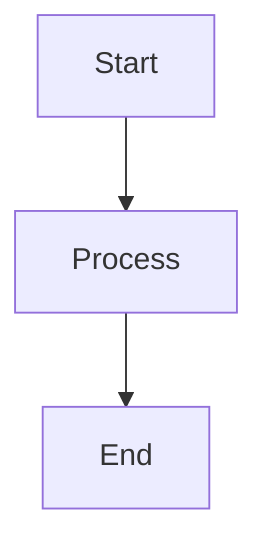

# Math & Diagrams

Informio supports KaTeX math expressions and Mermaid diagrams with live preview in the editor.

## Inline Math

Wrap an expression in single dollar signs:

```markdown
The equation $E = mc^2$ is famous.
```

The editor renders the formula inline as you type. Click the rendered formula to edit the source. Use arrow keys to move out of the expression.

Inline math also converts automatically: type `$x^2$` and it renders when you close the second `$`.

## Block Math

Use double dollar signs on their own lines:

```markdown
$$
\int_0^\infty e^{-x^2} dx = \frac{\sqrt{\pi}}{2}
$$
```

Or type `$$` on a plain paragraph and press Enter to create an empty math block.

Click the rendered block to edit its source. Click outside to see the preview again.

## Mermaid Diagrams

Create a fenced code block with the `mermaid` language tag:

````markdown

````

The editor renders the diagram inline. Supported Mermaid diagram types include flowcharts, sequence diagrams, class diagrams, Gantt charts, and more.

You can also insert a Mermaid chart from the Insert toolbar (chart icon).

## Live Preview

Both math and diagrams render live in the editor. When the cursor is inside the block, the raw source is shown for editing. When the cursor moves out, the rendered preview appears.

## Math Syntax Reference

| Syntax         | Result          |
|----------------|-----------------|
| `$x^2$`       | x squared       |
| `$\frac{a}{b}$` | fraction     |
| `$\sqrt{x}$`  | square root     |
| `$\sum_{i=0}^{n}$` | summation |

## See also

- [Code Blocks](code-blocks.md) — fenced code blocks (non-Mermaid)
- [Markdown Basics](markdown-basics.md) — Typora-style input rules
- [Callouts, Details & Footnotes](callouts-details-footnotes.md) — other block types
